# 📐 Entity Relationship Diagram (ERD)
## Complete Data Model for OldSchool

```mermaid
erDiagram
    %% CIN7 CORE ENTITIES
    CUSTOMER {
        string id PK
        string name
        string email UK
        string phone
        string status
        decimal credit_limit
        string price_tier
        boolean is_on_credit_hold
        string location
        string sales_representative
        datetime last_modified_on
        datetime _fivetran_synced
    }
    
    SALE {
        string id PK
        string customer_id FK
        string order_number UK
        datetime order_date
        string order_status
        decimal order_total
        decimal order_tax
        string location
        string source_channel
        string sales_representative
        datetime _fivetran_synced
    }
    
    SALE_ORDER_LINE {
        string id PK
        string sale_id FK
        string product_id FK
        decimal quantity
        decimal unit_price
        decimal line_total
        decimal discount_amount
    }
    
    PRODUCT {
        string id PK
        string sku UK
        string name
        string barcode UK
        string category_id FK
        string brand
        decimal price_tier_1
        decimal price_tier_2
        string stock_locator
        string default_location
        string status
    }
    
    PRODUCT_MOVEMENT {
        string movement_id PK
        string product_id FK
        datetime movement_date
        string movement_type
        decimal quantity
        string reference_id
        string location
    }
    
    NON_ZERO_STOCK {
        string product_id FK
        string location
        decimal quantity_on_hand
        datetime last_updated
    }
    
    CUSTOMER_ADDRESS {
        string id PK
        string customer_id FK
        string address_type
        string address_line_1
        string city
        string postal_code
        string country
    }
    
    PURCHASE {
        string id PK
        string supplier_id FK
        string purchase_order_number
        datetime order_date
        string status
        decimal total_amount
    }
    
    PURCHASE_ORDER_LINE {
        string id PK
        string purchase_id FK
        string product_id FK
        decimal quantity_ordered
        decimal unit_cost
        decimal line_total
    }
    
    %% SHOPIFY ENTITIES (When Available)
    SHOPIFY_ORDER {
        string id PK
        string order_number
        string customer_id FK
        datetime created_at
        string financial_status
        string fulfillment_status
        decimal total_price
        string currency
    }
    
    SHOPIFY_ORDER_LINE {
        string id PK
        string order_id FK
        string product_id FK
        string variant_id FK
        decimal quantity
        decimal price
        decimal total_discount
    }
    
    SHOPIFY_CUSTOMER {
        string id PK
        string email UK
        string first_name
        string last_name
        string phone
        decimal total_spent
        integer orders_count
        string state
    }
    
    SHOPIFY_PRODUCT {
        string id PK
        string title
        string vendor
        string product_type
        string handle UK
        string status
        datetime published_at
    }
    
    SHOPIFY_VARIANT {
        string id PK
        string product_id FK
        string sku UK
        decimal price
        decimal compare_at_price
        integer inventory_quantity
        string barcode
    }
    
    %% XERO ENTITIES (Future)
    XERO_INVOICE {
        string invoice_id PK
        string invoice_number UK
        string contact_id FK
        datetime date
        datetime due_date
        decimal total
        string status
        string type
    }
    
    XERO_CONTACT {
        string contact_id PK
        string name
        string email UK
        boolean is_customer
        boolean is_supplier
    }
    
    XERO_LINE_ITEM {
        string line_item_id PK
        string invoice_id FK
        string item_code FK
        decimal quantity
        decimal unit_amount
        string account_code
    }
    
    %% UNIFIED DIMENSIONS
    DIM_CUSTOMER {
        string customer_key PK
        string cin7_customer_id
        string shopify_customer_id
        string xero_contact_id
        string master_email UK
        string master_name
        string customer_segment
        decimal lifetime_value
    }
    
    DIM_PRODUCT {
        string product_key PK
        string cin7_product_id
        string shopify_product_id
        string xero_item_code
        string master_sku UK
        string master_name
        string category
        decimal current_price
    }
    
    FACT_SALES {
        string sale_key PK
        string customer_key FK
        string product_key FK
        datetime sale_date
        string source_system
        decimal quantity
        decimal total_amount
        decimal tax_amount
        decimal profit_margin
    }
    
    %% RELATIONSHIPS
    CUSTOMER ||--o{ SALE : "places"
    CUSTOMER ||--o{ CUSTOMER_ADDRESS : "has"
    SALE ||--o{ SALE_ORDER_LINE : "contains"
    PRODUCT ||--o{ SALE_ORDER_LINE : "sold_in"
    PRODUCT ||--o{ PRODUCT_MOVEMENT : "tracked_by"
    PRODUCT ||--o| NON_ZERO_STOCK : "stocked_at"
    PURCHASE ||--o{ PURCHASE_ORDER_LINE : "contains"
    PRODUCT ||--o{ PURCHASE_ORDER_LINE : "purchased_in"
    
    SHOPIFY_CUSTOMER ||--o{ SHOPIFY_ORDER : "places"
    SHOPIFY_ORDER ||--o{ SHOPIFY_ORDER_LINE : "contains"
    SHOPIFY_PRODUCT ||--o{ SHOPIFY_VARIANT : "has"
    SHOPIFY_VARIANT ||--o{ SHOPIFY_ORDER_LINE : "ordered"
    
    XERO_CONTACT ||--o{ XERO_INVOICE : "billed_to"
    XERO_INVOICE ||--o{ XERO_LINE_ITEM : "contains"
    
    %% Cross-System Mappings
    CUSTOMER }o--o| SHOPIFY_CUSTOMER : "matched_by_email"
    CUSTOMER }o--o| XERO_CONTACT : "matched_by_name"
    PRODUCT }o--o| SHOPIFY_VARIANT : "matched_by_sku"
    SALE }o--o| SHOPIFY_ORDER : "synced"
    SALE }o--o| XERO_INVOICE : "invoiced"
    
    %% Unified Model
    DIM_CUSTOMER ||--o{ FACT_SALES : "purchases"
    DIM_PRODUCT ||--o{ FACT_SALES : "sold"
```



## 🔗 Key Relationships Explained

### Primary Keys (PK)
- Each table has a unique identifier
- Usually `id` field from source system
- Fivetran maintains these during sync

### Foreign Keys (FK)
- Link related records across tables
- Enable JOIN operations
- Maintain referential integrity

### Cross-System Matching
- **Email** - Primary matching field for customers
- **SKU** - Primary matching field for products
- **Order Number** - Can link sales to invoices

### Cardinality
- `||--o{` = One to Many (1:N)
- `}o--o|` = Many to One (N:1)
- `||--||` = One to One (1:1)

## 📊 Data Flow

```
Source Systems          Staging Layer         Intermediate          Marts (Power BI)
─────────────          ─────────────         ────────────          ───────────────
                                                                   
Cin7 Core ─────┐       stg_cin7_*            int_unified_*         fact_sales
               │       - sales               - customers           dim_customers
               ├──────>- customers      ────>- products      ────> dim_products
               │       - products             - sales               dim_date
               │       - inventory                                  
               │                                                    
Shopify ───────┤       stg_shopify_*         int_channel_*         fact_inventory
               │       - orders               - online_sales        fact_fulfillment
               ├──────>- customers      ────>- web_customers ────> 
               │       - products             - ecommerce           
               │                                                    
Xero (Future) ─┘       stg_xero_*            int_financial_*       fact_revenue
                       - invoices             - ar_invoices         fact_costs
                       - contacts       ────>- ap_invoices   ────> dim_accounts
                       - line_items           - gl_entries          
```

## 🎯 Integration Points

### Customer Master Data Management
1. Cin7 customer is primary source
2. Shopify customers matched by email
3. Xero contacts matched by name/email
4. Create unified `dim_customers` with all IDs

### Product Catalog Harmonization
1. Cin7 product is inventory truth
2. Shopify variants for online catalog
3. Match by SKU, fallback to barcode
4. Handle variant → master product mapping

### Sales Transaction Consolidation
1. Cin7 sales for B2B/wholesale
2. Shopify orders for B2C/ecommerce
3. Xero invoices for financial reporting
4. Unified in `fact_sales` with source tracking